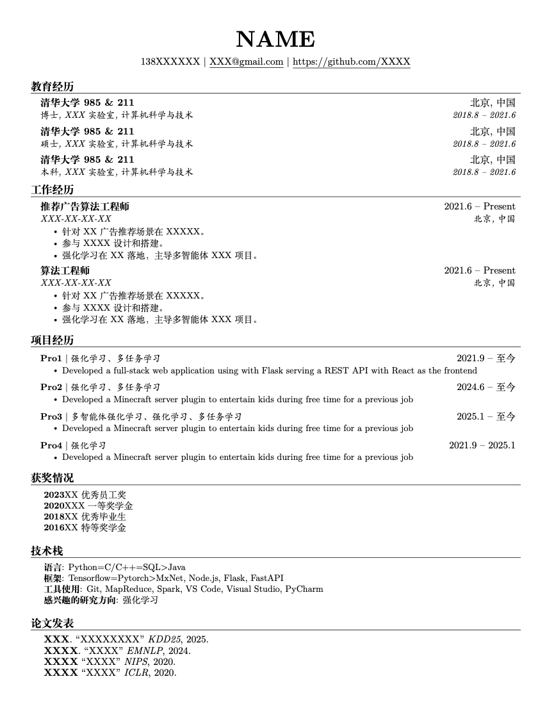

# LaTeX 中文，计算机科学与技术，程序员，算法工程师的简历模版

## 示例

下面是使用该模板生成的示例：

## 快速开始

您可以通过以下两种方式使用此模板：

1. **使用 Overleaf（推荐）**
   
   点击下面的链接直接在Overleaf中打开模板：
   
   

## 使用说明

1. 修改 `main.tex` 文件中的标题、作者等信息

## 参考链接
https://github.com/jakegut/resume

# 许可证

本项目使用 MIT 许可证

## 数据所有权

本项目使用或生成的所有数据由 **Sourabh Bajaj** 所有。

---

### English Version:

This project is licensed under the MIT License

All data used and/or generated by this project is owned by **Sourabh Bajaj**.
